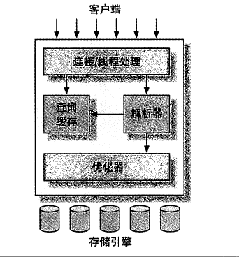

## mysql基础知识
- mysql逻辑架构
  - mysql的逻辑架构分为三层，如下图所示
  - 第一层:连接处理，安全认证，授权等。是大多数基于网络的工具都会出现的架构。
  - 第二层:这一层是绝大多数Mysql的核心服务所在层。包括了查询解析、语句分析、语句优化、缓存以及所有内置函数(日期、时间、数字、加密...)。同时所有跨存储引擎的功能也在这一层实现：存储过程、触发器以及视图等。
  - 第三层:主要为mysql的存储引擎，负责Mysql的数据存储与提取。存储引擎提供API，用于与服务端的通信。通过这些API接口，屏蔽了存储引擎之间的差异。存储引擎通过API去处理诸如开始事务，查询记录等操作。存储引擎不会解析SQL，不同存储引擎之间不相互通信，只是简单地响应来自于上层服务的请求

- 连接管理与安全性
        - 每个客户端连接对应服务器中的一个线程，对应的操作只会在对应的线程中执行。
        - 当客户端连接到Mysql服务器时，服务器会对其进行基于用户名+原始主机信息+密码的认证。认证成功以后还会验证客户端是否具有执行特定操作的权限。
- 优化与执行
    - mysql会解析查询，创建内部数据结构(解析树),对其进行优化，包括重写查询、决定表的读取顺序、选择合适的索引。用户可以通过指定的关键字提示优化器影响其决策过程，也可以请求优化器解释优化整个过程的各个因素。便于用户通过优化决策的过程重构查询、schema以及修改相关配置
      - 对于select语句，解析查询前服务器会检查查询缓存。存在则不再执行查询解析、优化和执行的过程，直接返回查询缓存中的结果集。
- 并发
    - 读写锁：读锁是共享的，互不阻塞的。多个用户可以同一时刻读取同一个表而不互相干扰。写锁是排他的，一个写锁会阻塞其他写锁和读锁。写锁比读锁优先级高。
    - 锁的粒度
      - 表锁：mysql最基本的锁策略，也是开销最小的策略。表锁会在操作时锁定整张表。用户对表进行写操作时必须先获得写锁,同时阻塞其他用户的读写操作。当写锁解除时，其他用户才可进行操作。无写锁时用户才能读操作。
        - 行级锁：可以最大程度支持并发处理(锁开销反而最大)。行级锁只在存储引擎层实现。
- 事务：一组原子性的SQL查询(一个独立的工作单元)。事务内的语句，要么全部执行成功要么全部执行失败。
    - ACID:
      - A:原子性
        - 一个事务必须被视为一个不可分割的最小工作单元。事务的所有操作要么全部成功提交要么全部失败回滚。不可能只执行其中的一部分。
      - C:一致性
        - 数据库总是从一个一一致性的状态转换到另一个一致性的状态。在执行增减两条操作之间出现异常时，因为最终事务没有提交，则事务所做修改也不会应用到数据库。数据库的状态依旧和本次操作前一致的
      - I:隔离性
        - 通常来说一个事务的操作在最终提交以前对其他事物不可见。当一个事务操作增加数量但是未提交事务时，其他事务看到的数据依旧是未增加之前的数据。
      - D:持久性
        - 一旦事务提交，其所作的修改就会永久保存到数据库。即使系统崩溃数据也不会丢失。
    - 隔离级别：SQL标准中定义了四种隔离级别，每一种级别规定了一个事务中所作的修改，那些在事务内和事务间是可见的，那些事不可见的。较低的隔离级别通常可以执行更高的并发，系统开销也更低。(不同引擎的隔离级别不尽相同，但是特性上可能有所差异)
        - READ UNCOMMITTED(未提交读)
          - 事务中的修改，即使没有提交其他事务也可见。事务可以读取未提交的事务，这就是脏读(Dirty Read)。该级别容易出问题
        - READ COMMITTED(提交读)
          - 该级别也叫不可重复读，大多数数据库系统的默认隔离级别，但是Mysql除外。事务开始时，只能看见已经提交的事务所做的更改，从事务开始到提交之前，所有的修改都对其他事务不可见。两次同样的查询，可能会得到不一样的结果。
        - REPEATABLE READ(可重复读)
          - 可重复读解决了脏读的问题。该级别保证了同一事务中多次读取同样记录的结果是一致的。但是该级别还是无法解决幻读(Phantom Read)问题``(当某个事务在读取某个范围内的记录是，另一个事务又在该范围内插入新的记录，当之前的事务再次读取该范围的记录时，会产生幻行(Phantom Row))``。InnoDB存储引擎通过多版本并发控制(MVVC，Multiversion Concurrency Control)解决了幻读的问题。
          - ``重复读是Mysql的默认事务隔离级别``
        - SERIALIZABLE(可串行化)