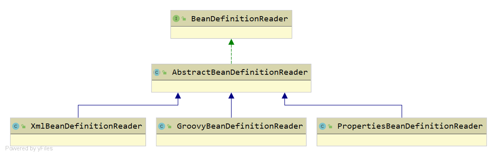
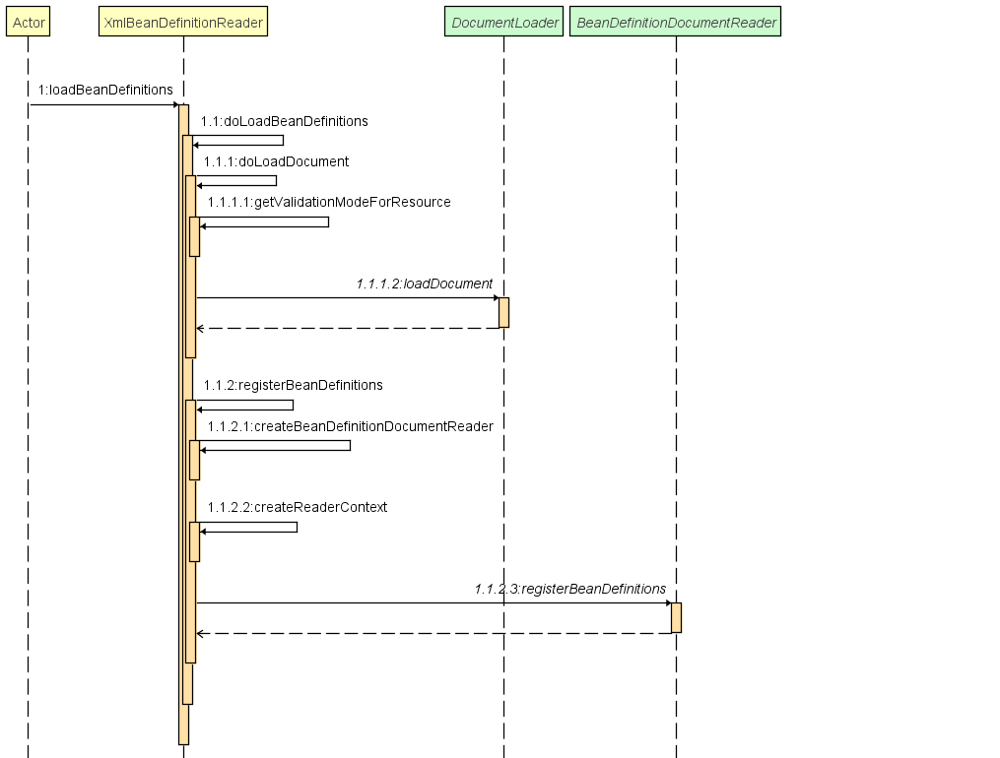
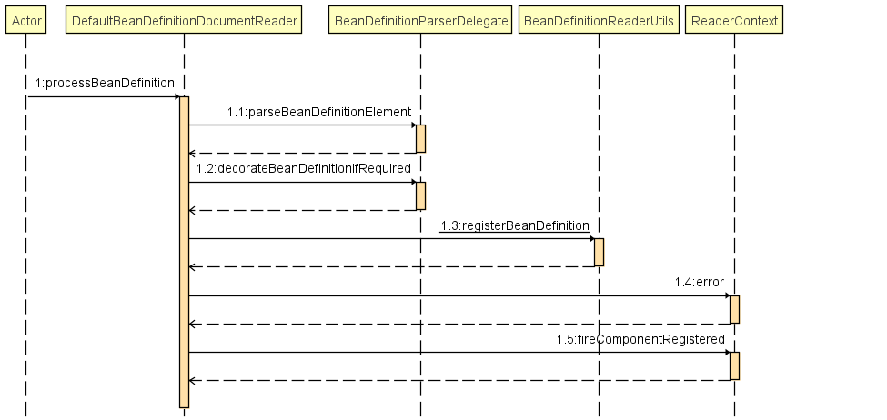

<!--
Spring IoC 容器对资源加载以后的资源装载环节
-->
对于Spring在资源方面的定义与处理逻辑，我们在[Spring统一资源加载篇](https://github.com/smallblack-xh/docs/blob/master/spring/Spring%E7%BB%9F%E4%B8%80%E8%B5%84%E6%BA%90%E5%8A%A0%E8%BD%BD.md)已经进行了大概的探索。为了进一步理解Spring IoC容器，我们可以先看下面的代码片段
```
public class XMLBeanDefinitionReaderDemo {
	public static void main(String[] args) {
		ClassPathResource resource = new ClassPathResource("bean.xml");
		DefaultListableBeanFactory factory = new DefaultListableBeanFactory();
		XmlBeanDefinitionReader reader = new XmlBeanDefinitionReader(factory);
		reader.loadBeanDefinitions(resource);
		XMLBeanDefinitionReaderDemo demo = factory.createBean(XMLBeanDefinitionReaderDemo.class);
		demo.action();
	}
	public void action(){
		System.out.println("action");
	}
}
```
- 从上述代码来看，我们以XmlBeanDefinitionReader为例子，我们大致分析下IoC容器的使用流程
  - 首先是整个执行过程的简易的时序图
  
  - 获取资源，使用Resource的实现类注入ClassPathResource、UrlResource对资源进行加载
  - 获取BeanFactory，使用BeanFactory接口的实现类诸如DefaultListableBeanFactory、XmlBeanFactory
  - 通过获取的BeanFactory创建BeanDefinitionReader的接口实现类如XmlBeanDefinitionReader对象，作为资源的解析器
  - 通过BeanDefinitionReader定义的loadBeanDefinitions对1中获取的Resource进行解析装载
  - 使用BeanFactory创建对象，并通过对象调用其内部定义的方法
- 总结上述的大致流程，我们可以将IoC容器的使用过程总结为：**资源定位** > **装载** > **注册**
- 这里我们先了解Spring的装载，大致如下
  - Spring的IoC内部存在一种数据类型*BeanDefinition*,用于存储Bean对象的相关信息。
  - IoC容器内部通过一个*Map数据结构*来存储BeanDefinition,*一个BeanDefinition对应一个Bean对象*
  - BeanDefinitionReader读取、解析Resource资源后将相关信息存储进BeanDefinition中
- ***BeanDefinitionReader***
  - Spring中提供了用于解析资源的基础接口:BeanDefinitionReader,其继承关系类图如下：
    
  - BeanDefinitionReader中定义了诸如loadBeanDefinitions、getResourceLoader等用于对资源进行解析操作的统一接口。在此基础上Spring提供了*AbstractBeanDefinitionReader*进一步对资源解析过程中的所需外部资源如*Environment*、*BeanDefinitionRegistry*进行封装，后续各种类型的解析器只需要通过继承*AbstractBeanDefinitionReader*即可。
- ***XmlBeanDefinitionReader***([XmlBeanDefinitionReader.java](https://github.com/smallblack-xh/spring-framework/blob/master/spring-beans/src/main/java/org/springframework/beans/factory/xml/XmlBeanDefinitionReader.java))
  - XML文件是Spring配置中很重要的一环，XML文件中的配置信息时Spring配置的绝大部分来源，所以对于XML文件的解析尤为重要。*XmlBeanDefinitionReader*就是Spring中针对XML文件的解析类，其继承了AbstractBeanDefinitionReader,负责对XML文件读取并转换为 BeanDefinition的各个功能。
  - 从上面的时序图中，我们可以发现，当所有资源准备完毕以后，实际上处理的业务在*loadBeanDefinitions*中
    - 我们先看该方法的调用时序图，再根据时序图调用链分析
      
    - loadBeanDefinitions内部逻辑
      - 封装资源文件：当进入XmlBeanDefinitionReader后首先对参数Resource使用*EncodedResource*(内部封装了Resource、encoding以及Charset,记录资源的编码规则)类进行封装
        - *EncodedResource*：内部封装了Resource、encoding以及Charset,记录资源的编码规则，主要是用于对资服文件的编码进行处理的。其中的主要逻辑体现在getReader()方法中，当设置了编码属性的时候Spring会使用相应的编码作为输入流的编码
          ```
          public Reader getReader() throws IOException {
            if (this.charset != null) {
              return new InputStreamReader(this.resource.getInputStream(), this.charset);
            }
            else if (this.encoding != null) {
              return new InputStreamReader(this.resource.getInputStream(), this.encoding);
            }
            else {
              return new InputStreamReader(this.resource.getInputStream());
            }
          }
          ```
      - 通过属性类记录已经加载过得资源:*ThreadLocal<Set<EncodedResource>> resourcesCurrentlyBeingLoaded*,用于校验资源是否出现重复加载的情况。
      - 获取输入流。从Resource巾获取对应的InputStrearn并构造lnputSource。*InputSource并不是Spring自带的类，而是引入了org.xml.sax.InputSource，通过SAX读取XML文件*
    - doLoadBeanDefinitions内部逻辑
      - doLoadDocument：从构造函数中我们进一步跟踪，到最后能看到下面的代码拆分开构造参数，我们能得知
      ```
        protected Document doLoadDocument(InputSource inputSource, Resource resource) throws Exception {
          return this.documentLoader.loadDocument(inputSource, getEntityResolver(), this.errorHandler,
              getValidationModeForResource(resource), isNamespaceAware());
        }     
      ```
        - 获取对XML文件的验证模式：通过*getValidationModeForResource(resource)*方法对XML资源进行校验
          - XML文件的验证模式保证了XML文件的正确性，而比较常用的验证模式有两种：DTD和XSD
            - DTD ( Document Type Definition ）即文档类型定义，是一种XML约束模式语言，是XML文件的验证机制 
            - XML Schema 语言就是XSD( XML Schemas Definition ）。XMLSchema描述了XML文件的结构。可以用一个指定的XMLSchema来验证某个XML文档，以检查该XML文档是否符合其要求
        - 加载XML文件，并得到对应的Document： *loadDocument(InputSource inputSource, EntityResolver entityResolver,ErrorHandler errorHandler, int validationMode, boolean namespaceAware)*
          - 委托给了*DocumentLoader*去执行，DocumentLoader是个接口，而真正调用的是*DefaultDocumentLoader*
          - 创建DocumentBuilderFactory，再通过DocumentBuilderFactory创建DocumentBuilder，进而解析inputSource来返回Document对象
          ```
          public Document loadDocument(InputSource inputSource, EntityResolver entityResolver,
              ErrorHandler errorHandler, int validationMode, boolean namespaceAware) throws Exception {
              DocumentBuilderFactory factory = createDocumentBuilderFactory(validationMode, namespaceAware);
              if (logger.isDebugEnabled()) {
                logger.debug("Using JAXP provider [" + factory.getClass().getName() + "]");
              }
              DocumentBuilder builder = createDocumentBuilder(factory, entityResolver, errorHandler);
              return builder.parse(inputSource);
          }
          ``` 
        - 根据返回的Document注册Bean信息
      - registerBeanDefinitions
        ```
        public int registerBeanDefinitions(Document doc, Resource resource) throws BeanDefinitionStoreException {
          //创建 BeanDefinitionDocumentReader 通过BeanUtil获取实现类DefaultBeanDefinitionDocumentReader
          BeanDefinitionDocumentReader documentReader = createBeanDefinitionDocumentReader();
          //获取已经注册的bean数量
          int countBefore = getRegistry().getBeanDefinitionCount();
          //注册bean
          documentReader.registerBeanDefinitions(doc, createReaderContext(resource));
          return getRegistry().getBeanDefinitionCount() - countBefore;
        }
        ```
        - 创建 BeanDefinitionDocumentReader 通过BeanUtil获取实现类DefaultBeanDefinitionDocumentReader
        - 获取已经注册的bean数量
        - 注册bean:*documentReader.registerBeanDefinitions(doc, createReaderContext(resource))*
          ```
          public void registerBeanDefinitions(Document doc, XmlReaderContext readerContext) {
            this.readerContext = readerContext;
            logger.debug("Loading bean definitions");
            //获取根目录root
            Element root = doc.getDocumentElement();
            doRegisterBeanDefinitions(root);
          }
          ```
        - ***doRegisterBeanDefinitions***：这里是整个Bean加载**最为关键**的环节
            ```
            protected void doRegisterBeanDefinitions(Element root) {
              BeanDefinitionParserDelegate parent = this.delegate;
              this.delegate = createDelegate(getReaderContext(), root, parent);

              if (this.delegate.isDefaultNamespace(root)) {
                String profileSpec = root.getAttribute(PROFILE_ATTRIBUTE);
                if (StringUtils.hasText(profileSpec)) {
                  String[] specifiedProfiles = StringUtils.tokenizeToStringArray(
                      profileSpec, BeanDefinitionParserDelegate.MULTI_VALUE_ATTRIBUTE_DELIMITERS);
                  if (!getReaderContext().getEnvironment().acceptsProfiles(specifiedProfiles)) {
                    if (logger.isInfoEnabled()) {
                      logger.info("Skipped XML bean definition file due to specified profiles [" + profileSpec +
                          "] not matching: " + getReaderContext().getResource());
                    }
                    return;
                  }
                }
              }

              preProcessXml(root);//方法体为空,与postProcessXml一样，都是使用了模板设计模式，允许后续其他实现类在该位置进行特殊定制化处理
              parseBeanDefinitions(root, this.delegate);
              postProcessXml(root);

              this.delegate = parent;
            }
            ```
        - 首先是处理profile属性
          ```
              //XML配置
              <?xml version="1.0" encoding="UTF-8"?>
            <beans xmlns="http://www.springframework.org/schema/beans" xmlns:xsi="http://www.w3.org/2001/XMLSchema-instance"
              xsi:schemaLocation="http://www.springframework.org/schema/beans https://www.springframework.org/schema/beans/spring-beans.xsd">
              <beans profile="dev"/>
              <beans profile="test"/>
            </beans>
            //web.xml配置
            <context-param> 
              <param-name>Spring.profiles.act:ive</param－name>
              <param-value>dev</param-value> 
            </context-param> 
          ```
        - *parseBeanDefinitions*
            ```	
              protected void parseBeanDefinitions(Element root, BeanDefinitionParserDelegate delegate) {
                // 检查 <beans /> 根标签的命名空间是否为空，或者是 http://www.springframework.org/schema/beans
                if (delegate.isDefaultNamespace(root)) {
                  NodeList nl = root.getChildNodes();
                  for (int i = 0; i < nl.getLength(); i++) {
                    Node node = nl.item(i);
                    if (node instanceof Element) {
                      Element ele = (Element) node;
                      //如果该节点使用默认命名空间，执行默认解析
                      if (delegate.isDefaultNamespace(ele)) {
                        parseDefaultElement(ele, delegate);
                      }
                      //如果该节点非默认命名空间，执行自定义解析
                      else {
                        delegate.parseCustomElement(ele);
                      }
                    }
                  }
                }
                //如果该节点非默认命名空间，执行自定义解析
                else {
                  delegate.parseCustomElement(root);
                }
              }
            ```
            - 在Spring中有两种Bean声明方式
                - 默认配置：``<bean id= "test" class= "testTestBean"/>``
                - 自定义配置``<tx:annotation-driven/> ``
            - parseBeanDefinitions中,先校验根节点或者子节点是否属于默认节点,默认节点使用*parseDefaultElement(ele, delegate)*
              - 源码
              ```
              private void parseDefaultElement(Element ele, BeanDefinitionParserDelegate delegate) {
                  //处理import标签
                  if (delegate.nodeNameEquals(ele, IMPORT_ELEMENT)) {
                    importBeanDefinitionResource(ele);
                  }
                  //处理alias标签
                  else if (delegate.nodeNameEquals(ele, ALIAS_ELEMENT)) {
                    processAliasRegistration(ele);
                  }
                  //处理bean标签
                  else if (delegate.nodeNameEquals(ele, BEAN_ELEMENT)) {
                    processBeanDefinition(ele, delegate);
                  }
                  //处理beans标签
                  else if (delegate.nodeNameEquals(ele, NESTED_BEANS_ELEMENT)) {
                    // recurse
                    doRegisterBeanDefinitions(ele);
                  }
              }
              ```
              - 上述几个类型的解析中，*processBeanDefinition*是逻辑最复杂的，我们先从其下手理解  
        - *DefaultBeanDefinitionDocumentReader.processBeanDefinition*
          - 时序图
          
          - 源码
          ```
            protected void processBeanDefinition(Element ele, BeanDefinitionParserDelegate delegate) {
               BeanDefinitionHolder bdHolder = delegate.parseBeanDefinitionElement(ele);
              if (bdHolder != null) {
                bdHolder = delegate.decorateBeanDefinitionIfRequired(ele, bdHolder);
                try {
                    // Register the final decorated instance.
                  BeanDefinitionReaderUtils.registerBeanDefinition(bdHolder, getReaderContext().getRegistry());
                }
                catch (BeanDefinitionStoreException ex) {
                  getReaderContext().error("Failed to register bean definition with name '" +
                      bdHolder.getBeanName() + "'", ele, ex);
                }
                // Send registration event.
                getReaderContext().fireComponentRegistered(new BeanComponentDefinition(bdHolder));
                }
            }
          ```
          - 大概流程
            - 委托BeanDefinitionParserDelegate的parseBeanDefinitionElement解析元素，获取BeanDefinitionHolder，BeanDefinitionHolder中已经包含了配置文件中的相关配置，注入class、id、alias
            - 当返回的bdHolder不为空的情况下若存在默认标签的子节点下再有自定义属性，还需要再次对自定义标签进行解析
            - 解析完成后，需要对解析后的bdHolder进行注册，同样，注册操作委托给了Bean­DefinitionReaderUtils的registerBeanDefinition方法
            - 最后发出响应事件，通知相关的监昕器，这个bean已经加载完成了
        - 