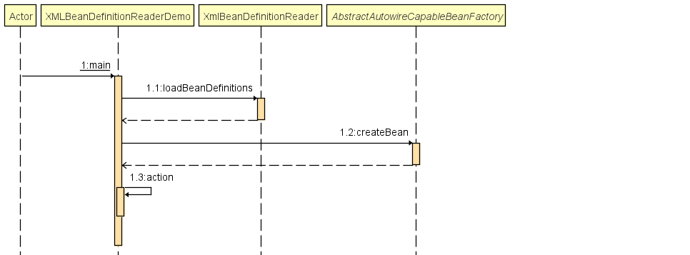

<!--
Spring IoC 容器对资源加载以后的资源装载环节
-->
对于Spring在资源方面的定义与处理逻辑，我们在[Spring统一资源加载篇](https://github.com/smallblack-xh/docs/blob/master/spring/Spring%E7%BB%9F%E4%B8%80%E8%B5%84%E6%BA%90%E5%8A%A0%E8%BD%BD.md)已经进行了大概的探索。为了进一步理解Spring IoC容器，我们可以先看下面的代码片段
```
public class XMLBeanDefinitionReaderDemo {
	public static void main(String[] args) {
		ClassPathResource resource = new ClassPathResource("bean.xml");
		DefaultListableBeanFactory factory = new DefaultListableBeanFactory();
		XmlBeanDefinitionReader reader = new XmlBeanDefinitionReader(factory);
		reader.loadBeanDefinitions(resource);
		XMLBeanDefinitionReaderDemo demo = factory.createBean(XMLBeanDefinitionReaderDemo.class);
		demo.action();
	}
	public void action(){
		System.out.println("action");
	}
}
```
- 从上述代码来看，我们以XmlBeanDefinitionReader为例子，我们大致分析下IoC容器的使用流程
  - 首先是整个执行过程的简易的时序图
  
  - 获取资源，使用Resource的实现类注入ClassPathResource、UrlResource对资源进行加载
  - 获取BeanFactory，使用BeanFactory接口的实现类诸如DefaultListableBeanFactory、XmlBeanFactory
  - 通过获取的BeanFactory创建BeanDefinitionReader的接口实现类如XmlBeanDefinitionReader对象，作为资源的解析器
  - 通过BeanDefinitionReader定义的loadBeanDefinitions对1中获取的Resource进行解析装载
  - 使用BeanFactory创建对象，并通过对象调用其内部定义的方法
- 总结上述的大致流程，我们可以将IoC容器的使用过程总结为：**资源定位** > **装载** > **注册**
- 这里我们先了解Spring的装载，大致如下
  - Spring的IoC内部存在一种数据类型*BeanDefinition*,用于存储Bean对象的相关信息。
  - IoC容器内部通过一个*Map数据结构*来存储BeanDefinition,*一个BeanDefinition对应一个Bean对象*
  - BeanDefinitionReader读取、解析Resource资源后将相关信息存储进BeanDefinition中
- ***XmlBeanDefinitionReader***([XmlBeanDefinitionReader.java](https://github.com/smallblack-xh/spring-framework/blob/master/spring-beans/src/main/java/org/springframework/beans/factory/xml/XmlBeanDefinitionReader.java))
  - XML文件是Spring配置中很重要的一环，XML文件中的配置信息时Spring配置的绝大部分来源，所以对于XML文件的解析尤为重要。*XmlBeanDefinitionReader*就是Spring中针对XML文件的解析类，负责对XML文件读取并转换为 BeanDefinition的各个功能。
  - 