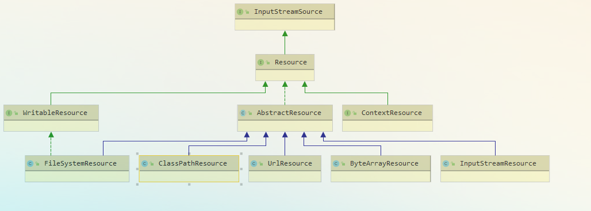
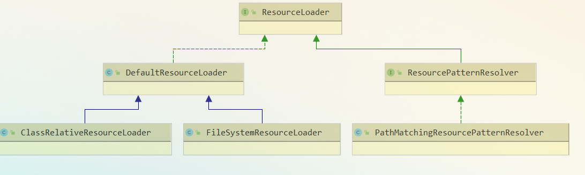

# Spring资源统一加载笔记
- Spring资源加载策略
  - 职能划分清楚：资源的定义和资源的加载应该要有一个清晰的界限
  - 统一的抽象：统一的资源定义和资源加载策略。资源加载后要返回统一的抽象给客户端，客户端要对资源进行怎样的处理，应该由抽象资源接口来界定。
- 统一资源：***Resource*([Resource.java](https://github.com/smallblack-xh/spring-framework/blob/5.0.x/spring-core/src/main/java/org/springframework/core/io/Resource.java))**   
   org.springframework.core.io.*Resource 为 Spring 框架所有资源的抽象和访问接口，它继承 org.springframework.core.io.InputStreamSource接口。作为所有资源的统一抽象，Resource 定义了一些通用的方法，由子类 AbstractResource 提供统一的默认实现。
  - 子类结构

    
    - FileSystemResource ：对 java.io.File 类型资源的封装，只要是跟 File 打交道的，基本上与 FileSystemResource 也可以打交道。支持文件和 URL 的形式，实现 WritableResource 接口，且从 Spring Framework 5.0 开始，FileSystemResource 使用 NIO2 API进行读/写交互
    - ByteArrayResource ：对字节数组提供的数据的封装。如果通过 InputStream 形式访问该类型的资源，该实现会根据字节数组的数据构造一个相应的 ByteArrayInputStream
    - UrlResource ：对 java.net.URL类型资源的封装。内部委派 URL 进行具体的资源操作
    - ClassPathResource ：class path 类型资源的实现。使用给定的 ClassLoader 或者给定的 Class 来加载资源
    - InputStreamResource ：将给定的 InputStream 作为一种资源的 Resource 的实现类
  - ***AbstractResource***([AbstractResource.java](https://github.com/smallblack-xh/spring-framework/blob/5.0.x/spring-core/src/main/java/org/springframework/core/io/AbstractResource.java))
    - org.springframework.core.io.AbstractResource ，为 Resource 接口的默认抽象实现,实现了 Resource 接口的大部分的公共实现。
    - 当需要实现自定义的Resource时，应该继承<u>*AbstractResource*</u>接口
- 统一资源定位：***ResourceLoader*([ResourceLoader.java](https://github.com/smallblack-xh/spring-framework/blob/5.0.x/spring-core/src/main/java/org/springframework/core/io/ResourceLoader.java))**  
  - 子类结构  
    
  - Spring 将资源的定义和资源的加载区分开了，Resource 定义了统一的资源，而资源的加载由 ***ResourceLoader***统一定义
  - org.springframework.core.io.ResourceLoader 为 Spring 资源加载的统一抽象，具体的资源加载则由相应的实现类来完成，所以我们可以将 ResourceLoader 称作为**统一资源定位器**
  - ResourceLoader根据给定的资源文件地址，返回对应的 Resource
  - 方法解读
    - Resource getResource(String location)  
        根据所提供资源的路径 location 返回 Resource 实例，但是它不确保该 Resource 一定存在，需要调用 Resource#exist() 方法来判断
      - 该方法支持以下模式的资源加载
        - URL位置资源，如 "file:C:/test.dat" 。
        - ClassPath位置资源，如 "classpath:test.dat 。
        - 相对路径资源，如 "WEB-INF/test.dat" ，此时返回的Resource 实例，根据实现不同而不同
      - 该方法的主要实现是在其子类[DefaultResourceLoader.java](https://github.com/smallblack-xh/spring-framework/blob/5.0.x/spring-core/src/main/java/org/springframework/core/io/DefaultResourceLoader.java)中实现
    - ClassLoader getClassLoader()  
        返回 ClassLoader 实例，对于想要获取 ResourceLoader 使用的 ClassLoader 用户来说，可以直接调用该方法来获取。在分析 Resource 时，提到了一个类 ClassPathResource ，这个类是可以根据指定的 ClassLoader 来加载资源的
  - 默认实现 ***DefaultResourceLoader*([DefaultResourceLoader.java](https://github.com/smallblack-xh/spring-framework/blob/5.0.x/spring-core/src/main/java/org/springframework/core/io/DefaultResourceLoader.java))**