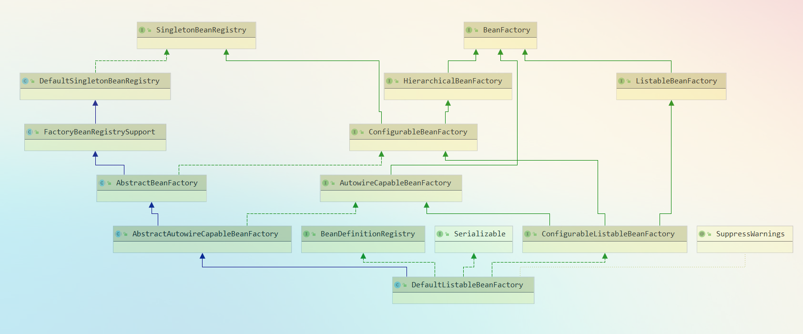
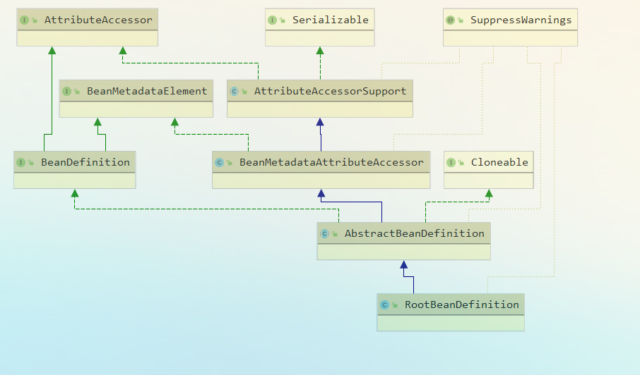
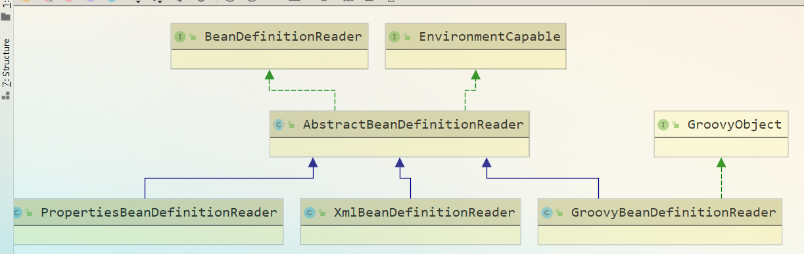

# IoC理论
- 概念
  - 全称 >> ``Inversion of Control(控制反转)``
  - 别名 >> ``Dependency Injection (依赖注入DI)``
- 定义
  - 所谓 IoC ，就是由 <strong>Spring IoC 容器</strong>来负责对象的生命周期和对象之间的关系
  - 抛砖引玉:理解IoC的四个问题：
    以相亲为例子，一般找女朋友，都需要自己去搜集妹子的各种资料，然后通过这些资料信息去找到和妹子接触的方法比如微信啥的，然后安排见面啥的，整个过程需要自己亲力亲为，有始有终。但是婚介所(IoC)的出现，让你只需要提供你的需求，就可以帮你匹配妹子然后全程帮你处理直接见面相亲。从原来的主动出击到后面的婚介所的介绍被动接受，过程精简了，但是结果和原来的一样。简单而言，IoC等同于让他人为你做服务。
    - 谁控制谁
      - 在传统的开发模式下，我们都是采用直接 new 一个对象的方式来创建对象，也就是说你依赖的对象直接由你自己控制，但是有了 IoC 容器后，则直接由 IoC 容器来控制。所以“谁控制谁”，当然是 ```IoC 容器控制对象```
    - 控制什么
      - 控制对象。
    - 为何是反转
      - 没有 IoC 的时候我们都是在自己对象中主动去创建被依赖的对象，这是正转。但是有了 IoC 后，所依赖的对象直接由 IoC 容器创建后注入到被注入的对象中，依赖的对象由原来的```主动获取```变成```被动接受```，所以是反转。
    - 哪些方面反转了  
      - 所依赖对象的获取被反转了。
- 注入形式
  - 构造器注入
    ```
    Man(WoMan woman){
        this.woman = woman;
    }
    ```
  - setter注入
    ```
    public void setWoman(Woman woman){
        this.woman = woman;
    }
    ```
  - interface注入  
    接口方式注入显得比较霸道，因为它需要被依赖的对象实现不必要的接口，带有侵入性。一般都不推荐这种方式。想了解的话参考[interface注入](http://wiki.jikexueyuan.com/project/spring-ioc/iocordi-1.html#6e5dfcd838f3a79e9129641785cf736f)
- [相关类图(可点击查看部分类继承)](https://www.processon.com/diagraming/5f89420ee401fd06fd8e06a9)
  - **Resource**  
    对资源的抽象。它的每一个实现类都代表了一种资源的访问策略，如 ClassPathResource、RLResource、FileSystemResource(源码解析详见[spring-Resource]())
  - **ResourceLoader**   
    Spring 利用 org.springframework.core.io.ResourceLoader 来进行统一资源加载(源码解析详见[spring-ResourceLoader]())
  - **BeanFactory** 
    <!--源码解析详见[spring-BeanFactory]()-->
     
    - org.springframework.beans.factory.BeanFactory，是一个非常纯粹的 bean 容器，它是 IoC 必备的数据结构，其中 BeanDefinition 是它的基本结构。BeanFactory 内部维护着一个BeanDefinition map ，并可根据 BeanDefinition 的描述进行 bean 的创建和管理。
    - BeanFactory 有三个直接子类 ListableBeanFactory、HierarchicalBeanFactory 和 AutowireCapableBeanFactory
    - DefaultListableBeanFactory 为最终默认实现，它实现了所有接口
  - **BeanDefinition**  
    org.springframework.beans.factory.config.BeanDefinition ，用来描述 Spring 中的 Bean 对象。  
    
  - **BeanDefinitionReader**  
    org.springframework.beans.factory.support.BeanDefinitionReader读取 Spring 的配置文件的内容，并将其转换成 Ioc 容器内部的BeanDefinition  
    
  - **ApplicationContext**  
    org.springframework.context.ApplicationContext ，这个就是大名鼎鼎的 Spring 容器，它叫做应用上下文，与我们应用息息相关。它继承 BeanFactory ，所以它是 BeanFactory 的扩展升级版，如果BeanFactory 是屌丝的话，那么 ApplicationContext 则是名副其实的高富帅。由于 ApplicationContext 的结构就决定了它与 BeanFactory 的不同，其主要区别有：
    - 继承 org.springframework.context.MessageSource 接口，提供国际化的标-准访问策略。
    - 继承 org.springframework.context.ApplicationEventPublisher 接口，提供强大的事件机制。
    - 扩展 ResourceLoader ，可以用来加载多种 Resource ，可以灵活访问不同的资源。
    - 对 Web 应用的支持。
    - 下图来源 [https://blog.csdn.net/yujin753/article/details/47043143](https://blog.csdn.net/yujin753/article/details/47043143)  
    
- **IoC主要由*spring-beans*、*spring-conext*实现**