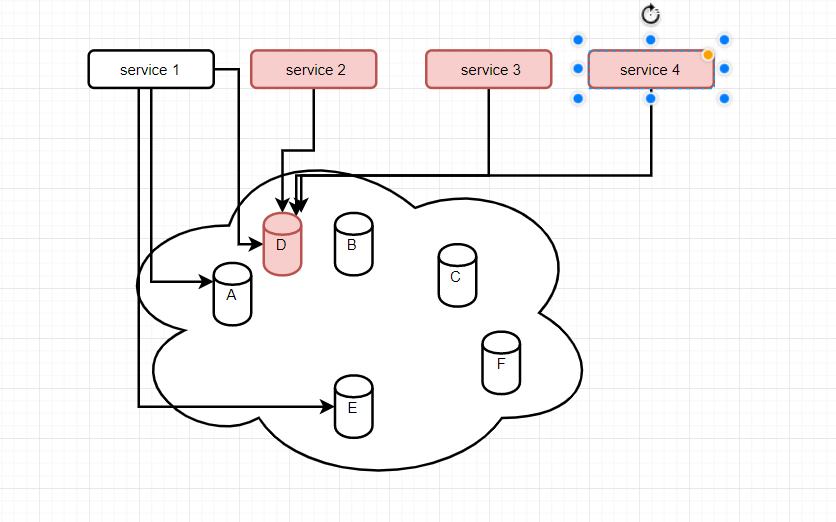

# Hystrix(豪猪哥)
## 雪崩效应
&ensp;&ensp;&ensp;&ensp;在分布式应用场景中，每个微服务都专注于自己的业务逻辑,对外提供相应的接口,同时与其他服务形成依赖关系。在服务依赖的整个调用链路中，如果一个链路节点所依赖的服务出现``异常导致服务不可用``时,其他调用该服务的链路会出现``调用等待以及不断重试调用``的情况。如果不及时对该异常服务进行处理，会导致依赖该服务的其他链路节点出现``大量请求积压，资源占用过载``等问题，从而导致整个服务``不可访问``。

## 雪崩效应的场景
- 硬件故障：如服务器宕机，机房断电，光纤被挖断等。
- 流量激增：如异常流量，重试加大流量等。
- 缓存穿透：一般发生在应用重启，所有缓存失效时，以及短时间内大量缓存失效时。大量的缓存不命中，使请求直击后端服务，造成服务提供者超负荷运行，引起服务不可用。
- 程序BUG：如程序逻辑导致内存泄漏，JVM长时间FullGC等。
- 同步等待：服务间采用同步调用模式，同步等待造成的资源耗尽。
## 雪崩效应解决方案
- 服务隔离
- 服务降级
- 服务熔断
- 服务断流

``Hystrix主要针对上述服务降级、熔断、限流实现服务的延迟以及容错处理``
## 何为Hystrix
一个针对分布式系统的``延迟``和``容错``的开源库,可通过添加等待时间容限和容错逻辑来帮助您控制这些分布式服务之间的交互。Hystrix通过隔离服务之间的访问点，停止服务之间的级联故障并提供后备选项来实现此目的，所有这些都可以改善系统的整体弹性。
## 服务降级
- 服务器忙,请稍后再试,不让客户端等待过久并``立刻返回一个友好的提示(fallback)``
- 常见场景
  - 程序运行异常
  - 服务超时
  - 服务熔断触发服务降级
  - 线程池、信号量打满导致服务降级 
## 服务熔断
- 当服务访问达到最大限度的访问量后,``直接拒绝访问``,然后``调用服务降级``的方法``返回友好提示``(类似于保险丝负载过大后直接熔断拉闸)
- 服务降级--->服务熔断--->恢复链路调用
- 熔断机制描述：应对雪崩效应的一种微服务链路保护机制。当扇出链路的某个微服务``出错不可用或者响应时间过长``时，进行``服务的降级``，进而``熔断该节点微服务的调用,快速返回错误的响应信息``。当该节点微服务调用``检测正常时，恢复链路的调用``
- example
    - 使用
        - @HystrixCommand
        - HystrixCommand中的参数(在时间窗口期内请求次数中的失败次数达到规定比例时实现断流)
          - circuitBreaker.enabled 是否开启断路器
          - circuitBreaker.requestVolumeThreshold 请求次数
          - circuitBreaker.sleepWindowInMilliseconds 时间窗口期
          - circuitBreaker.errorThresholdPercentage 失败率达到多少比例时断流
  - code
    - 
    ``` 
    @HystrixCommand(
            commandProperties = {
                    @HystrixProperty(name = "circuitBreaker.enabled",value = "true"),
                    @HystrixProperty(name = "circuitBreaker.requestVolumeThreshold",value = "10"),
                    @HystrixProperty(name = "circuitBreaker.sleepWindowInMilliseconds",value = "10000"),
                    @HystrixProperty(name = "circuitBreaker.errorThresholdPercentage",value = "60"),

            },
            fallbackMethod = "circuitBreakerFallback"
    )
    public String circuitBreaker(Integer id){
        if(id<0){
            throw new RuntimeException("非正数不得入内");
        }
        return IdUtil.simpleUUID();
    }
    public String circuitBreakerFallback(Integer id){
        return "circuitBreakerFallback";
    }
    ```
- 熔断类型
  - 熔断打开(open) 
    - 请求不再调用当前服务，内部设置时钟一般为MTTR(平均故障处理时间),当打开时长达到所设时钟则进入半熔断状态
  - 熔断关闭(closed)
    - 熔断关闭不会对服务进行熔断
  - 熔断半开(half open)
    - 部分请求根据规则调用当前服务，如果请求成功且符合规则则认为当前服务正在恢复户或者已经正常，关闭熔断
## 服务限流
- 后续使用``sentinel``替换
## 工作流程
- 