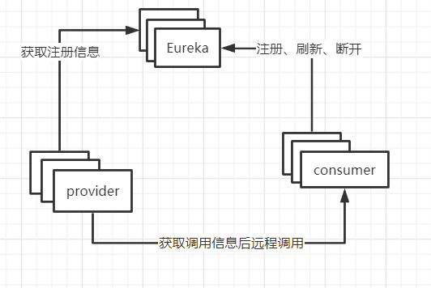

*$\color{#42b983}{以下相关概念均为本人通过阅读相关文档以及博客总结而成，如果有相关概念差异过大的情况出现，请多指教~}$*
## 服务治理
在微服务架构盛行的当下,如何对众多的服务进行统一管理、调配,是服务治理的关键所在。服务治理在rpc远程调用框架中，管理服务之间的依赖关系，以实现服务调用、负载均衡、服务容错、以及服务的注册与发现。
## 服务发现
分布式微服务架构下的各个微服务之间要想实现对其他服务的调用，就需要获得对应服务所维护的相关服务调用信息(比如服务地址、对外接口等),这一过程称之为服务发现
## 注册中心
注册中心是对服务发现的具体实现。提供了微服务相关信息存储的平台，通过该平台能够实现对其他服务的相关调用信息的配置以及获取
## 服务注册
微服务将自身的一些配置信息传递到注册中心中进行存储,以供其他服务获取调用的过程称之为服务注册
## <a name='Eureka续约配置'>Eureka续约配置</a>
## 现有注册中心
- Eureka
- Zookeeper
- Consul
- Nacos
## Eureka
- 何为Eureka  
Eureka是一项基于REST（代表性状态转移）的服务，以实现负载均衡和中间层服务器的故障转移。我们称此服务为Eureka Server。Eureka还带有一个基于Java的客户端组件Eureka Client，它使与服务的交互更加容易。客户端还具有一个内置的负载平衡器，可以执行基本的循环负载平衡。在Netflix，更复杂的负载均衡器将Eureka包装起来，以基于流量，资源使用，错误条件等多种因素提供加权负载均衡，以提供出色的弹性。
- Eureka 架构

- 内置组件
  - eureka-server注册中心服务端
    - 服务注册
      服务提供方启动服务时，会根据其指定的Eureka Server注册中心的相关配置，通过Eureka Client将其自身的信息注册到Eureka Server上,Eureka Server 会存储该服务的信息，且其内部通过二层缓存机制来维护整个服务注册表。
    - 提供注册表
      服务消费者在调用服务时,如果消费者端所在的Eureka Client 没有缓存注册表的话，会从Eureka Server获取最新的注册表
    - 同步状态
      Eureka Client通过注册、心跳机制和Eureka Server定时同步当前客户端的状态,汇报当前服务的相关状态
  - eureka-client
    Eureka Client是一个用于简化与Eureka Server注册中心交互过程的Java 客户端。Eureka Client在整个生命周期过程中会不停地从Eureka Server中拉取、更新和缓存相关的服务信息。即使Eureka Server宕机不可用时，服务消费者依然可以使用缓存中的信息找到服务提供者，但是此时由于服务中心的信息与实际服务存在差异，可能导致调用结果的不一致。
    -  服务注册
       服务提供方作为eureka-client，也需要将自身的相关信息比如IP地址、端口号、服务状态等相关信息注册到注册中心上，以供其他服务拉取存储以及调用
    -  服务续约
       Eureka Client与注册中心Eureka Server之间会通过定时的心跳检测来检查服务的可用性。默认会每隔30秒发送一次心跳，通过心跳来告知Eureka Server当前服务提供者运行正常。在默认情况下在 90 秒内没有收到Eureka Client的心跳反馈，注册中心就会认为当前服务已经不可用,从而将实例从其注册表中删除，心跳检测相关的时间可配置，在后面的<a href='#Eureka续约配置'>Eureka续约配置</a>可以参考。
    -  服务剔除
    -  服务剔除
    -  获取注册列表信息