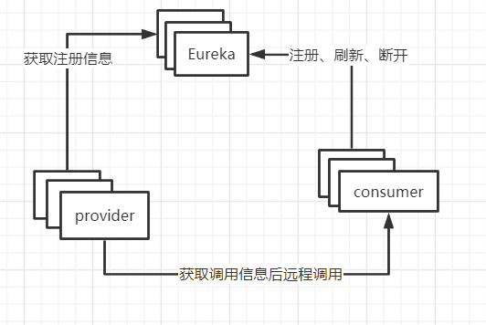
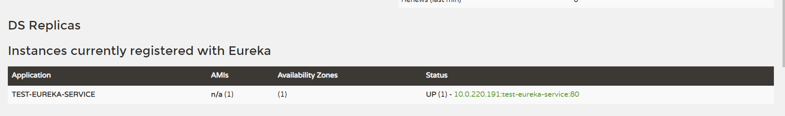
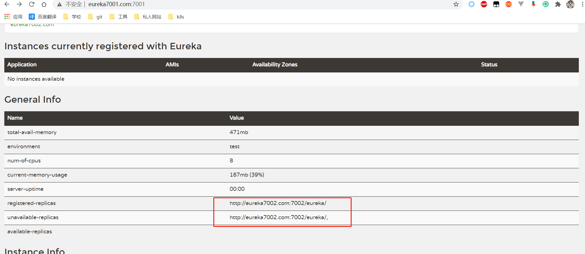
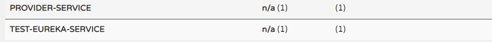

*$\color{#42b983}{以下相关概念均为本人通过阅读相关文档以及博客总结而成，如果有相关概念差异过大的情况出现，请多指教~}$*
## 服务治理
在微服务架构盛行的当下,如何对众多的服务进行统一管理、调配,是服务治理的关键所在。服务治理在``rpc远程调用框架中,管理服务之间的依赖关系，``以实现服务调用、负载均衡、服务容错、以及服务的注册与发现。
## 服务发现
分布式微服务架构下的各个微服务之间要想实现对其他服务的调用，就需要获得对应服务所维护的相关服务调用信息(比如服务地址、对外接口等),这一过程称之为服务发现
## 注册中心
注册中心是对服务发现的具体实现。提供了微服务相关信息存储的平台，通过该平台能够实现对其他服务的相关调用信息的配置以及获取
## 服务注册
微服务将自身的一些配置信息传递到注册中心中进行存储,以供其他服务获取调用的过程称之为服务注册
## <a name='Eureka续约配置'>Eureka续约配置</a>
## 现有注册中心
- Eureka
- Zookeeper
- Consul
- Nacos
## Eureka
- 何为Eureka  
Eureka是一项基于REST（代表性状态转移）的服务，以实现负载均衡和中间层服务器的故障转移。我们称此服务为Eureka Server。Eureka还带有一个基于Java的客户端组件Eureka Client，它使与服务的交互更加容易。客户端还具有一个内置的负载平衡器，可以执行基本的循环负载平衡。在Netflix，更复杂的负载均衡器将Eureka包装起来，以基于流量，资源使用，错误条件等多种因素提供加权负载均衡，以提供出色的弹性。
- Eureka 架构

 - 内置组件
    - eureka-server注册中心服务端
      - 服务注册
        服务提供方启动服务时，会根据其指定的Eureka Server注册中心的相关配置，通过Eureka Client将其自身的信息注册到Eureka Server上,Eureka Server 会存储该服务的信息，且其内部通过二层缓存机制来维护整个服务注册表。
      - 提供注册表
        服务消费者在调用服务时,如果消费者端所在的Eureka Client 没有缓存注册表的话，会从Eureka Server获取最新的注册表
      - 同步状态
        Eureka Client通过注册、心跳机制和Eureka Server定时同步当前客户端的状态,汇报当前服务的相关状态
    - eureka-client
      Eureka Client是一个用于简化与Eureka Server注册中心交互过程的Java 客户端。Eureka Client在整个生命周期过程中会``不停地从Eureka Server中拉取、更新和缓存相关的服务信息``。即使Eureka Server宕机不可用时，服务消费者依然可以使用缓存中的信息找到服务提供者，但是此时由于服务中心的信息与实际服务存在差异，可能导致调用结果的不一致。
      -  服务注册
         服务提供方作为eureka-client，也需要将自身的相关信息比如``IP地址、端口号、服务状态等相关信息``注册到注册中心上，以供其他服务拉取存储以及调用
      -  服务续约
         Eureka Client与注册中心Eureka Server之间会通过``定时的心跳检测``来检查``服务的可用性``。默认会每隔30秒发送一次心跳，通过心跳来告知Eureka Server当前服务提供者运行正常。在默认情况下在 90 秒内没有收到Eureka Client的心跳反馈，注册中心就会认为``当前服务已经不可用``,从而将实例从其``注册表中删除``，心跳检测相关的时间可配置，在后面的<a href='#Eureka续约配置'>Eureka续约配置</a>可以参考。
      -  服务剔除
         当Eureka Client与注册中心出现心跳续约异常时，Eureka Server根据指定的检测超时时间，在超出等待时间以后将其剔除，从注册表中移除该服务
      -  服务下线
         Eureka Client在下线时向注册中心发送取消注册请求。发送请求后Eureka Server将服务从其实例注册表中删除。该下线请求不会自动完成，它需要```调用DiscoveryManager.getInstance().shutdownComponent()手动下线```
      -  获取注册列表信息
         Eureka Client通过注册中心获取各个服务在注册中心实例注册表中的相关信息，并将其缓存在本地。客户端通过该注册表信息查找其他服务，根据查找结果进行远程调用。Eureka Client通过定期设置（默认每30秒钟）更新注册表信息。每次获取的注册列表信息可能与客户端自身存储的缓存信息不同，Eureka Client通过自身业务自动处理。
      -  远程调用
         Eureka Client通过``注册表``中记录的服务对应的``实际RPC远程调用地址``，使用``HttpClient``技术实现接口远程调用。调用过程中，如果存在多个服务提供方时，会自动使用ribbon进行负载均衡。
  - example(单机版)
    - Eureka Server
      - 引入对应的依赖(springboot+maven项目为主)
        ```
        <dependency>
            <groupId>org.springframework.cloud</groupId>
            <artifactId>spring-cloud-starter-netflix-eureka-server</artifactId>
        </dependency>
        ```
      - application.yml配置
        ```
        server:
          port: 7001
        eureka:
          instance:
            hostname: localhost
          client:
            #false 表示不向服务中心注册自己
            register-with-eureka: false
            #false表示自己就是注册中心，职责是维护服务实例，不需要检索服务
            fetch-registry: false                service-url:
              defaultZone: http://localhost:7001/eureka
        ```
      - application启动类加注解``@EnableEurekaServer``
      - 打开localhost:7001/eureka
      - 
    - Eureka Client(需要两个，一个作为服务提供方，另一个作为服务消费方)
      - 服务提供方，引入对应的依赖(springboot+maven项目为主)
        ```
        <dependency>
            <groupId>org.springframework.cloud</groupId>
            <artifactId>spring-cloud-starter-netflix-eureka-client</artifactId>
        </dependency>
        ```
      - application.yml配置
        ```
        server:
          port: 80
        spring:
          application:
            name: localhost
        eureka:
          client:
            register-with-eureka: true
            fetch-registry: true
            service-url:
              defaultZone: http://localhost:7001/eureka
        ```
      - application启动类加注解``@EnableEurekaClient``
      - 打开localhost:7001查看是否注册到7001
      - 
      - 消费者端的配置基本与上述一致
        ```
        server:
          port: 8001
        spring:
          application:
          //这里一定要注意，因为后面restTemplate调用是需要这个服务名的
            name: TEST_EUREKA-SERVICE
        eureka:
          client:
            register-with-eureka: true
            fetch-registry: true
            service-url:
              defaultZone: http://localhost:7001/eureka
        ```
    - 如何调用服务
      - 在Eureka-client的服务提供方项目上添加controller方法
      ```
        @RestController
        public class TestController {
            
            @Value("${server.port}")
            private String serverPort;

            @GetMapping("/test/{id}")
            public String search(@PathVariable("id") Integer id){
                return "端口: "+serverPort+" 查找的ID为: "+id;
            }
        }
       ```
      - 在服务消费方添加controller，注意：restTemplate调用的url中的host名为上述对应的消费者端配置的spring.application.name
        ```
        //配置restTemplate
        @Configuration
        public class RestTemplateConfig {
            @Bean
            @LoadBalanced
            public RestTemplate getRestTemplate(){
                return new RestTemplate();
            }
        }

        //请求方法
        @RestController
        @RequestMapping(value = PublicConstant.API_VERSION)
        public class TestController {
          //这一步使用时，要确保上面RestTemplate中@LoadBalanced注解有配置
          //如果使用的是指定IP的方式访问(比如localhost:8001)，就可以不需要配置
            private static final String URL = "http://TEST_EUREKA-SERVICE";

            @Resource
            private RestTemplate restTemplate;

            @GetMapping("/consumer/test/{id}")
            public CloudResult search(@PathVariable("id") Integer id){
                return restTemplate.postForObject(URL+"/test/{id}",String.class);
            }
        }
        ```
      - 访问localhost:80/consumer/test/1,页面返回结果为``端口: 8001 查找的ID为: 1``时服务测试通过
  - example(集群版)
    - 以安装单机版的Eureka Server为例子加以改造
      - 引入maven依赖
      - 配置host映射(自行百度如何设置，建议使用switchhost软件。如果不做这一步配置，则将下文中的eureka7001.com以及eureka7002.com替换为localhost即可)
        ```
        127.0.0.1 eureka7001.com
        127.0.0.1 eureka7002.com
        ```
      - 配置对应的端口(7001以及7002)，并且两个注册中心互相进行注册
        ```
        //7001配置
        server:
          port: 7001
        eureka:
          instance:
            hostname: eureka7001.com
          client:
            #false 表示不向服务中心注册自己
            register-with-eureka: false
            #false表示自己就是注册中心，职责是维护服务实例，不需要检索服务
            fetch-registry: false                
            service-url:
              defaultZone: http://eureka7002.com:7002/eureka

        //7002配置
        server:
          port: 7002
        eureka:
          instance:
            hostname: eureka7002.com
          client:
            #false 表示不向服务中心注册自己
            register-with-eureka: false
            #false表示自己就是注册中心，职责是维护服务实例，不需要检索服务
            fetch-registry: false                
            service-url:
              defaultZone: http://eureka7001.com:7001/eureka
        ```
      - 启动两个服务，访问eureka7001.com:7001以及eureka7002.com:7002。可以看到类似下图的场景
          
      - 参照8001服务提供者项目再新建一个提供者项目，端口号设置为8002,然后启动提供者跟消费者项目,刷新eureka7001.com:7001以及eureka7002.com:7002,两个注册中心中的信息出现如下截图则集群搭建成功
        
      - 服务调用，访问localhost/consumer/test/1。如果返回结果为``端口: 8001 查找的ID为: 1``服务测试通过
      - 当你多次刷新时，你会发现端口号会随着刷新出现变化，有时候8001，有时候8002
  - 注意点
    - **Eureka Client中，8001和8002项目的YML文件中的spring.application.name特别重要。在单机版本中，我们在80项目中使用RestTemplate调用8001的服务时，可以直接使用``restTemplate.postForObject("localhost:8001/test/{id}",String.class)``进行调用。但是在多集群中，一个服务对应的ip+host可能存在多个，这个时候我们就需要用到spring.application.name所配置的服务名。通过该服务名对服务进行调用``restTemplate.postForObject(URL+"/test/{id}",String.class)``。但是这种方式使用时必须对RestTemplate进行配置，对其增加@LoadBalanced注解，启用Ribbon的负载均衡功能，才能实现对服务的调用，假如不加该注解，该服务接口是无法调通的**
    - __Eureka Server构建集群时，作为注册中心的服务需要注册除了自己以外的其他注册中心Eureka地址，已实现相互注册功能。而单机版的时候，只需要注册在自己上面即可__