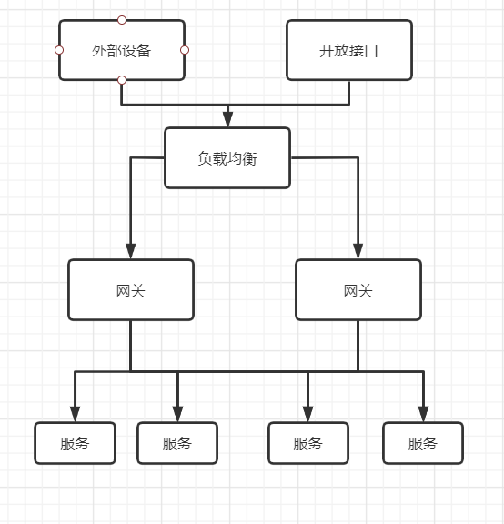

# 何为网关
- 是啥玩意儿  
   网关(Gateway)又称网间连接器、协议转换器。网关在传输层上以实现网络互连，是最复杂的网络互连设备，仅用于两个高层协议不同的网络互连。网关的结构也和路由器类似，不同的是互连层。网关既可以用于广域网互连，也可以用于局域网互连。简单来说，你从一个房间走到另一个房间，中间需要经过一扇门。同样，从一个网络向另一个网络发送信息，也必须经过一道“关口”，这道关口就是网关。顾名思义，网关(Gateway)就是一个网络连接到另一个网络的“关口”。 
- 有啥作用(针对微服务)
  - 统一通道入口：微服务模式下，相同的、不同的应用可能对应的调用地址都不一样，如果通过点对点的客户端调用，势必增加服务开发的复杂性，耦合度也较高。通过网关，我们可以提供统一的入口，将外部调用方和内部服务地方进行隔离，保障后台服务的安全性
  - 鉴权校验：识别每个请求的 权限，拒绝不符合要求的请求
  - 动态路由：结合nginx等负载均衡的配置，动态的将请求路由到不同的集群中
  - 降低耦合度：减少客户端与服务的耦合，服务可以独立开来，通过网关层来做映射调用
- 微服务架构下网关的架构
  
# SpringCloud-Gateway
- Gateway是基于异步非阻模型进行开发的。Spring Cloud Gateway使用Webflux中的reactor-netty响应式编程组件，底层使用了Netty通讯框架
- Gateway用途
  - 反向代理
  - 鉴权
  - 流量控制
  - 熔断
  - 日志监控等
- Gateway三大核心概念
  - Route(路由)：路由是构建网关的基础，由ID、目标URL、断言以及过滤器组成。当断言为true时匹配该路由
  - Predicate(断言)：请求与断言匹配时进行路由
  - Filter(过滤器)：Spring GatewayFilter，在请求被路由前或者路由后对请求进行修改
  - **总结：Gateway请求开始时，通过断言选择匹配对应的路由，然后通过过滤器对请求进行处理以后，再调用对应的执行逻辑完成请求**