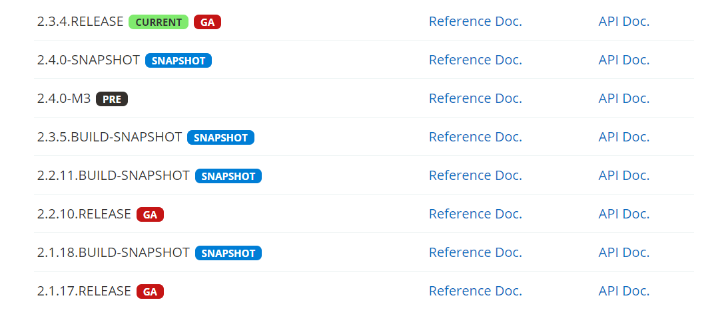
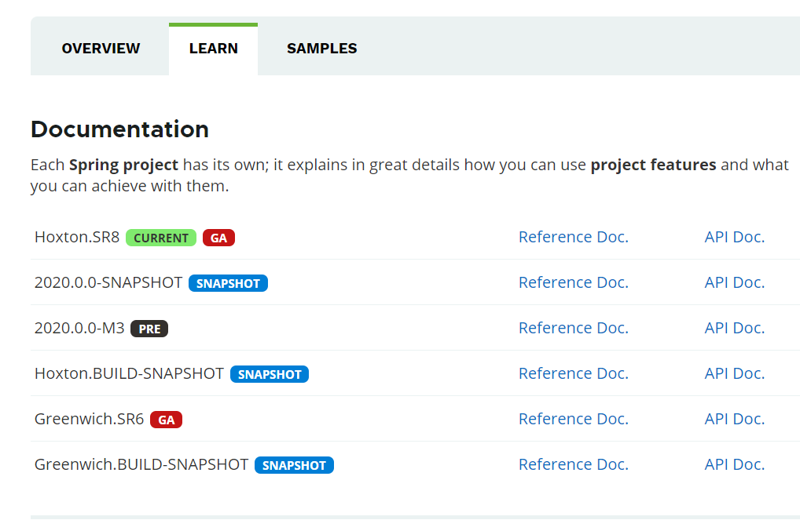
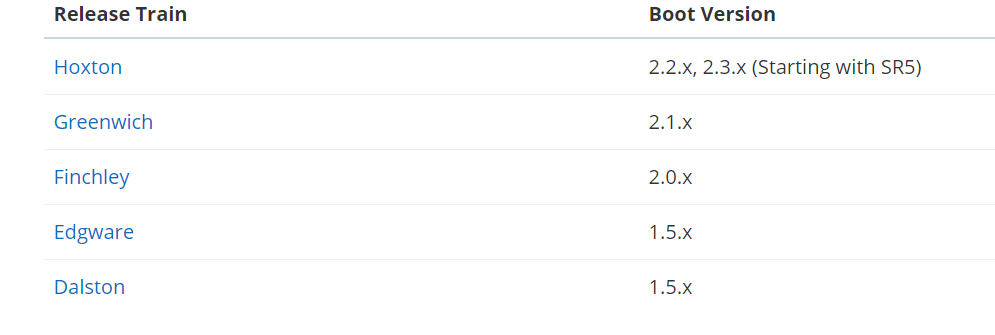
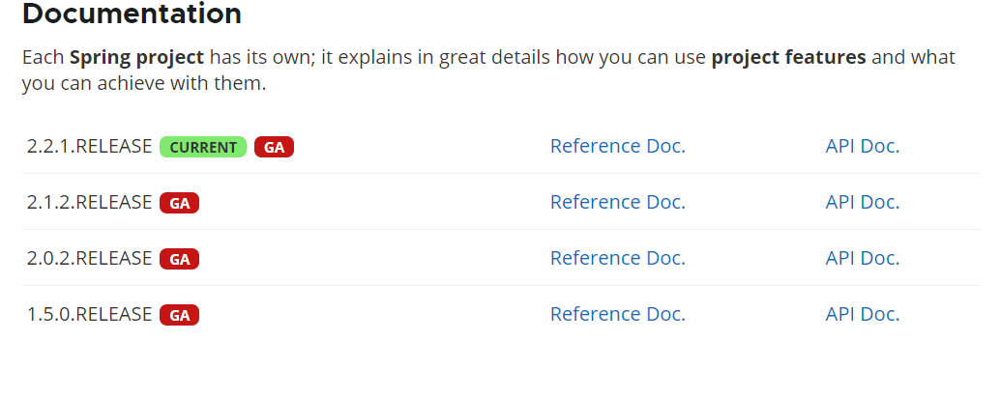
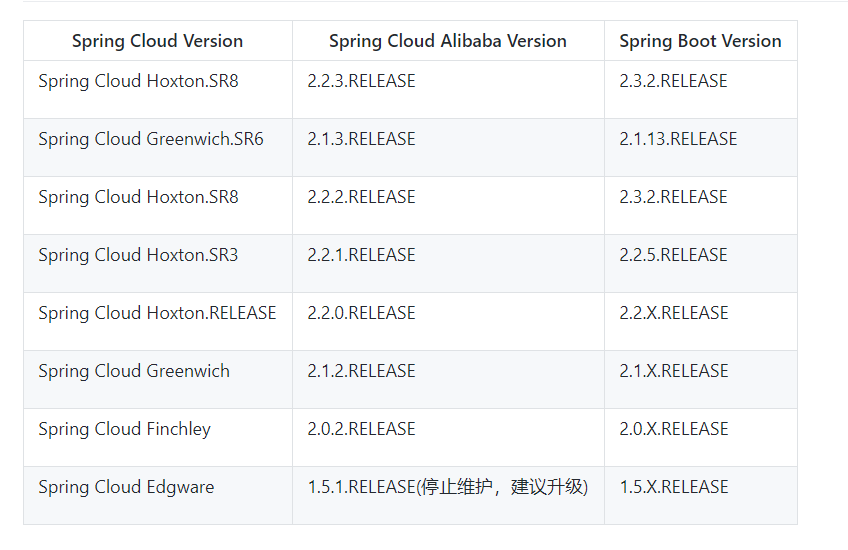

## Springboot
- 源码地址 https://github.com/spring-projects/spring-boot
- 官网 https://spring.io/projects/spring-boot/#learn
- 从官网的描述来看,截止至2020年9月,官网维护的版本如下图

## SpringCloud
- 源码地址 https://github.com/spring-projects/spring-cloud
- 官网 https://spring.io/projects/spring-cloud
- 从官网的描述来看,截止至2020年9月,官网维护的版本如下图

## Springboot与SpringCloud的版本选择问题
- Springboot的版本以数字(1.x.x、2.x.x)标记版本,而SpringCloud使用伦敦地铁站的名称，同时根据字母表的顺序来对应版本时间顺序，比如：最早的Release版本：Angel，第二个Release版本：Brixton...
- springboot与springcloud的关系，在对应的官网上都有做出一系列的版本对应，具体参照[Release train Spring Boot compatibility](https://spring.io/projects/spring-cloud/#overview)
  

## SpringCloud Alibaba
- 源码地址
- 官网 从官网的描述来看,截止至2020年9月,官网维护的版本如下图https://spring.io/projects/spring-cloud-alibaba#learn

- [与Springboot以及SpringCloud的版本对应](https://github.com/alibaba/spring-cloud-alibaba/wiki/%E7%89%88%E6%9C%AC%E8%AF%B4%E6%98%8E)
